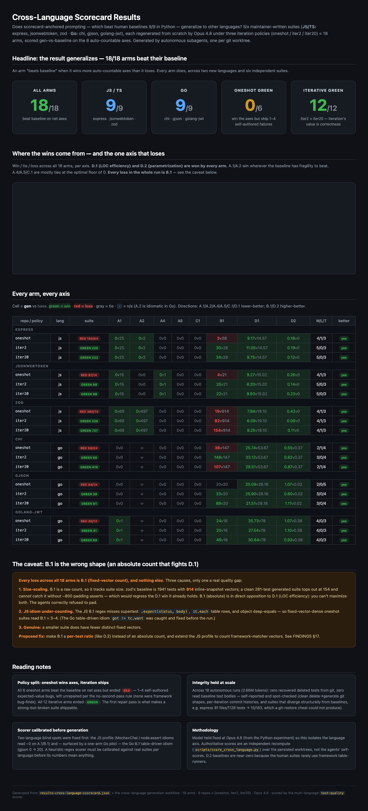

# beyond-test-coverage

## Are LLM-generated tests better human written tests?

We need to put numbers to it. *Code
coverage* is a vanity metric. 100%-covered suites are
routinely brittle, over-mocked, and noisy; coverage tells you a line
*ran*, not that a test would *catch the regression that breaks it*.

`beyond-test-coverage` measures the thing coverage can't: **test
quality**. Point it at a repository and it regenerates the test suite
from the source through a **read → build → evaluate** loop, optimizing
for the qualities that make a suite actually load-bearing:

- **Anti-fragility** — tests that survive a benign refactor. No
  asserting on error-message *substrings*, no recomputing the expected
  value with the same code under test, no reaching into private
  internals, no `||`-joined "passes if any of these" assertions.
- **Rigor** — assert against *known-good fixed values* (precomputed
  vectors, inline snapshots), cover the boundaries, and exercise real
  behavior end-to-end rather than re-deriving it.
- **Mocking discipline** — zero hand-rolled mocks of the unit under
  test. Drive the real thing through framework primitives (supertest,
  `httptest`, fake timers) or real objects; mock only true external
  boundaries.
- **Reuse & efficiency** — fold repetition into table-driven /
  parametrized cases instead of copy-paste; fewer lines per test.
- **Correctness** — every test passes, and every non-obvious assumption
  is verified against the real library, not guessed.
- **Coverage as a floor, not a target** — never regress it, never chase
  it.

An **evaluate** function (the [`test-quality`](.claude/skills/test-quality/)
scorer) measures each of these axes on the generated suite *and* on the
original, and reports a win/loss/tie per axis. If the suite hasn't beaten
the baseline — or isn't green — the loop reads, rebuilds, and re-evaluates.
Through that loop the suite improves not just in coverage but in
**quality**: the result is a test suite that is **stronger, more robust,
and less noisy** than the surface it replaced.

## Does it actually work?

To find out, we took a set of widely-used open-source libraries with
**exceptional, maintainer-written test suites**, measured their baseline
on every axis, **deleted every test**, and regenerated the suite from the
source under increasing iteration budgets (a single pass, up to
iterate-until-it-stops-improving) — scoring each generated suite against
the human original. Every round's findings fed back into the prompts and
the scorer, hardening the tool with each pass.

Nine libraries, three languages, the strongest test suites we could find:

| Library | Lang | What it is | Beat the human baseline? |
|---|---|---|:--:|
| `pallets/itsdangerous` | Python | signing / serialization | ✅ |
| `encode/httpx` | Python | HTTP client | ✅ |
| `psf/requests` | Python | HTTP client | ✅ |
| `expressjs/express` | JS | web framework | ✅ |
| `auth0/node-jsonwebtoken` | JS | JWT | ✅ |
| `colinhacks/zod` | TS | schema validation | ✅ |
| `go-chi/chi` | Go | HTTP router | ✅ |
| `tidwall/gjson` | Go | JSON query | ✅ |
| `golang-jwt/jwt` | Go | JWT | ✅ |

### Results

The headline is the gap between *chasing coverage* and *chasing quality*.
When the loop was pointed at **coverage**, the regenerated suites beat the
human baseline on only **2 of 9** runs — they hit coverage parity and
stopped. Re-aimed at the **quality scorecard**, they won **every** run:

```
Regenerated suites that beat the human-written test suite
──────────────────────────────────────────────────────────
Coverage-driven   (Python)   ██░░░░░░░░   2 / 9     22%
Quality-driven    (Python)   ██████████   9 / 9    100%
Quality-driven    (JS / TS)  ██████████   9 / 9    100%
Quality-driven    (Go)       ██████████   9 / 9    100%
```

Across **27 quality-driven runs** (9 libraries × 3 iteration budgets),
**every one beat its human-written baseline** on the auto-countable axes —
9/9 on Python, 18/18 across JS/TS and Go. The wins are consistent and
structural: the generated suites are dramatically **more LOC-efficient**
and **more parametrized** than every baseline, carry **zero fragile
substring/private/recomputed assertions**, and use **no hand mocks** of
the code under test — while holding or raising coverage.

Two honest caveats the numbers also surfaced:

- **A single pass already wins the quality axes** for every library — but
  it tends to ship 1–4 self-authored failing tests. The *iteration* budget
  is what makes the suite green and widens the margin. Quality and
  shippability are different milestones.
- The one axis the generated suites sometimes lose is **fixed-vector
  count**, because we score it as an absolute count that scales with suite
  size and competes with LOC-efficiency. (Re-shaping it into a per-test
  *ratio* is the next change — see [`CHANGELOG.md`](CHANGELOG.md).)

**Explore the numbers yourself:**

- [`docs/cross-language-results.html`](docs/cross-language-results.html) —
  interactive dashboard for the cross-language experiment (JS/TS + Go):
  per-axis win/tie/loss across all 18 arms, the one-shot-vs-iterate split,
  and the full per-suite matrix.
- [`docs/python-results.html`](docs/python-results.html) — the
  Python dashboard, including the decomposition of *why* coverage-driven
  scored 2/9 and quality-driven scored 9/9.
- [`FINDINGS.md`](FINDINGS.md) — the full running analysis.

Static previews live in [`examples/`](examples/) (GitHub renders the HTML
dashboards as source, so open them locally for the interactive charts):

[](docs/cross-language-results.html)

## The quality scorecard

The criteria above are a multi-axis rubric; the scorer auto-counts the
mechanical ones and leaves the judgement ones to review:

| Group | Axes |
|---|---|
| **A — anti-fragility** | A.1 error-substring asserts · A.2 private-symbol access · A.3 tautological readbacks · A.4 recomputed expected values · A.5 `‖`-joined matches · A.6 hand-coded charsets |
| **B — rigor** | B.1 fixed-vector asserts / snapshots · B.2 boundary coverage · B.3 framework-primitive integration |
| **C — mocking** | C.1 hand mocks of the unit (target 0) · C.2 framework primitives (legitimate) |
| **D — reuse** | D.1 LOC per test · D.2 parametrize ratio · D.3 fixture/inheritance reuse |
| **E — correctness** | E.1 all green · E.2 out-of-band-verified assumptions · E.3 mutation sensitivity |
| **F — coverage floor** | F.1 line · F.2 branch — non-regression only |

[`scripts/...score.py`](.claude/skills/test-quality/scripts/score.py)
auto-counts A.1/A.2/A.4/A.5, B.1, C.1/C.2, D.1/D.2 across Python, JS/TS,
and Go and prints the head-to-head Win/Loss/Tie tally. The rest are
review-time judgement calls.

## Use it on your own suite

The reusable artifacts are two bundled [Claude Code skills](.claude/skills/):

- [`test-quality`](.claude/skills/test-quality/) — the scorer, the
  anti-fragility contract, and the read→build→evaluate loop definition. This is
  the product: point it at a suite to audit, harden, or generate tests against
  the quality scorecard.
- [`results-dashboard`](.claude/skills/results-dashboard/) — renders a scorecard
  JSON into the same interactive HTML readouts you see in `docs/`.

A clone is self-contained, so both skills are auto-discovered when you open the
repo in Claude Code. You can also install them into any project in one step via
the bundled [`.claude-plugin/marketplace.json`](.claude-plugin/marketplace.json):

```
/plugin marketplace add <owner>/<this-repo>
/plugin install test-quality-tools@beyond-test-coverage
```

Or score any suite directly, without the skill harness:

```bash
python .claude/skills/test-quality/scripts/score.py \
    --tests path/to/tests --baseline path/to/old_tests --lang python|js|go
```

## Repository layout

```
.
├── .claude/skills/               # two bundled Claude Code skills:
│   ├── test-quality/             #   scorer + rubric + read→build→evaluate loop
│   └── results-dashboard/        #   scorecard JSON → interactive HTML readout
├── .claude-plugin/               # marketplace.json — one-command install of both
├── docs/                         # interactive results dashboards
├── prompts/                      # the prompt sets that drive generation
├── scripts/                      # setup, scoring, and aggregation harness
├── configs/                      # per-repo coverage config
├── reports/ · runs/              # preserved reports & worktree inventories
├── results-*.{json,md}           # the scored results behind the dashboards
├── FINDINGS.md                   # running analysis (what we learned)
└── CHANGELOG.md                  # how the rubric & prompts evolved per stage
```

The nine libraries under test are each cloned locally into their own
git-ignored directory; **they are not redistributed here** and remain
under their own licenses. Generated suites live on preserved branches inside
those clones.

## How the experiment is organized

The work proceeded in three stages. Each froze a prompt set, ran it against
the libraries, and fed its findings into the next:

- **Coverage-driven control** (Python). Prompts aimed at coverage %. Beat
  the human baseline on only 2/9 — the suites hit coverage parity and
  stopped. This is the control that motivated everything else.
- **Quality-driven** (Python). Same repos, prompts re-aimed at the quality
  scorecard. 9/9. An *ablation* arm held the model fixed at Opus 4.7 and
  swapped only the prompts, isolating the effect: the prompt redesign did
  the heavy lifting; the model upgrade was a marginal top-up (FINDINGS §10).
- **Cross-language** (JS/TS + Go). New libraries, same approach. 18/18 —
  the result generalizes beyond Python.

The frozen prompt sets live under [`prompts/quality/`](prompts/quality/) and
[`prompts/cross-language/`](prompts/cross-language/); the scored artifacts are
`results-{coverage,quality,ablation,cross-language}-*.{json,md}`.
[`CHANGELOG.md`](CHANGELOG.md) records the rubric/prompt delta per stage and
[`FINDINGS.md`](FINDINGS.md) the evidence; proposed rubric changes queue under
CHANGELOG `[Unreleased]`.

## License

[MIT](LICENSE) © Michael Rollins. The third-party repositories under test
are *not* included in this repo (each is cloned locally and git-ignored)
and remain under their own respective licenses.
